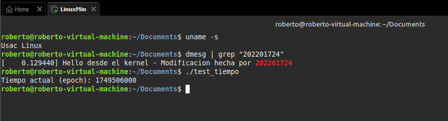

# Compilación de un Kernel Linux Personalizado

---

Este script te guiará a través del proceso de compilación de un kernel Linux personalizado, que incluye un mensaje de bienvenida personalizado, el cambio del nombre del sistema y una nueva llamada al sistema para obtener la hora actual.

---

## **Paso 1: Preparación del Entorno**

Asegúrate de que tu sistema esté actualizado e instala las herramientas necesarias para la compilación del kernel.

```bash
sudo apt update && sudo apt upgrade -y
sudo apt install build-essential libncurses-dev bison flex libssl-dev libelf-dev -y
```

## **Paso 2: Descarga y Configuración del Kernel**
Crea un directorio para el kernel, descarga el código fuente y prepáralo para la configuración.

```bash
mkdir -p ~/kernel/usac-linux
cd ~/kernel/usac-linux

wget [https://cdn.kernel.org/pub/linux/kernel/v6.x/linux-6.6.30.tar.xz](https://cdn.kernel.org/pub/linux/kernel/v6.x/linux-6.6.30.tar.xz)
tar -xf linux-6.6.30.tar.xz
cd linux-6.6.30

cp /boot/config-$(uname -r) .config
make olddefconfig
```

## **Paso 3: Modificaciones del Código Fuente del Kernel**

Aquí realizarás las modificaciones específicas en el código fuente del kernel.

Mensaje Personalizado en el Inicio del Kernel
Edita el archivo `init/main.c` para agregar un mensaje que se mostrará al inicio del kernel.

```bash
nano init/main.c
```
Busca la función `asmlinkage void __init start_kernel(void)` y agrega la siguiente línea dentro de ella:

```bash
printk(KERN_INFO "hola soy el Kernel y esto lo hizo 202201724\n");
```

##  **Cambiar el Nombre del Sistema (UTS_SYSNAME)**
Modifica el archivo include/linux/uts.h para cambiar el nombre del sistema que reporta el kernel.

```bash
nano include/linux/uts.h
```

Busca la línea `#define UTS_SYSNAME "Linux"` y cámbiala por:

```bash
define UTS_SYSNAME "USAC Linux"
```
No olvidar el `#`

### Agregar una Nueva Llamada al Sistema (Syscall)
Implementa una nueva llamada al sistema para obtener la hora actual en segundos desde el Epoch.

Crear la Implementación de la Syscall
Edita el archivo `kernel/sys.c` y agrega el siguiente código al final del archivo:

```bash
nano kernel/sys.c
```

```C
#include <linux/time.h>
#include <linux/ktime.h>
#include <linux/syscalls.h>

SYSCALL_DEFINE0(mi_tiempo)
{
    struct timespec64 ts;
    ktime_get_real_ts64(&ts);
    return ts.tv_sec;  // Retorna solo los segundos
}
```

### Registrar la Nueva Syscall en la Tabla de Llamadas al Sistema
Edita el archivo `arch/x86/entry/syscalls/syscall_64.tbl` y agrega la siguiente línea al final:

```bash
nano arch/x86/entry/syscalls/syscall_64.tbl
```

```bash
548     common  mi_tiempo    sys_mi_tiempo
```

### Declarar la Nueva Syscall en los Encabezados
Edita el archivo `include/linux/syscalls.h` y agrega la siguiente declaración al final:

```bash
nano include/linux/syscalls.h
```
```C
asmlinkage long sys_mi_tiempo(void);
```

## Paso 4: Compilación e Instalación del Kernel
Una vez que hayas realizado todas las modificaciones, procede a compilar e instalar el nuevo kernel.

```bash
make -j$(nproc)
sudo make modules_install
sudo make install
sudo update-grub
```

Después de esto, reinicia tu sistema para que el nuevo kernel sea cargado. Deberías seleccionar "USAC Linux" o el kernel correspondiente en el menú de GRUB al iniciar.

Para saber si funciono usar el archivo llamado `test_tiempo.c` con las siguientes instrucciones para compilarlo
```bash
gcc test_tiempo.c -o test_tiempo
./test_tiempo
```

PRUEBA
