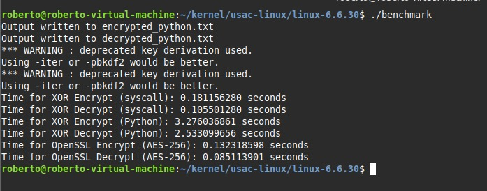

# Kernel System Call Implementation: XOR Encryption and Decryption

## Teamates

| Full name | carné |
|---|---|
| José Lorenzana | 202206560 |
| Roberto García | 202201724 |
| Javier Avila | 202200392 |
| Diego Gomez | 201908327 |

## Introduction

Working with the Linux kernel is a complex and error-prone task if one lacks the necessary experience and knowledge. This report documents all the steps followed during the development of two custom system calls: `xor_encrypt` and `xor_decrypt`. These system calls perform multithreaded XOR encryption and decryption using a provided key file.

We also discuss the issues encountered during the process and explain the solutions applied. Code snippets are included to illustrate key parts of the implementation.

---

## 1. Objective

To implement two custom system calls within the Linux kernel:

- `xor_encrypt`: Encrypts a file using XOR logic and a key file.
- `xor_decrypt`: Performs decryption using the same mechanism (XOR is symmetric).

Both use multithreading to divide the data into segments and process them in parallel.

---

## 2. Kernel Modification Summary

### Files Involved

- `usac_syscalls.c`: Contains logic for both `xor_encrypt` and `xor_decrypt`.
- `usac_syscalls.h`: Header file declaring the system calls.
- `syscall_table.S` and `unistd.h`: Modified to include the new syscalls (not shown in full here).

---

## 3. System Call Implementation

### Data Structures

```c
typedef struct {
    unsigned char *data;
    size_t data_size;
    unsigned char *key;
    size_t key_size;
    size_t start;
    size_t end;
} DataFragment;

struct task_parameters {
    DataFragment fragment;
    struct completion done;
};
```

Each thread processes a fragment of the file independently using the key file for XOR operations.

### XOR Thread Function

```c
int xor_task(void *arg) {
    ...
    for (i = fragment->start; i < fragment->end; i++) {
        fragment->data[i] ^= fragment->key[i % fragment->key_size];
    }
    ...
}
```

### Core Logic in `process_file`

```c
input_file = filp_open(input_path, O_RDONLY, 0);
output_file = filp_open(output_path, O_WRONLY | O_CREAT | O_TRUNC, 0644);
key_file = filp_open(key_path, O_RDONLY, 0);
```

- Files are read using `kernel_read`.
- Memory is allocated with `vmalloc` for data and key.
- Threads are created using `kthread_run`.
- Completion is used for thread synchronization.

### Final Step: Write Encrypted/Decrypted Output

```c
ret = kernel_write(output_file, data_buffer, input_file_size, &output_offset);
```

---

## 4. User-Level Programs

### encrypt.c

Calls system call 548 (`xor_encrypt`):

```c
long resultado = syscall(548, archivo_entrada, archivo_salida, archivo_clave, num_hilos);
```

### decrypt.c

Calls system call 549 (`xor_decrypt`):

```c
long resultado = syscall(549, archivo_entrada, archivo_salida, archivo_clave, num_hilos);
```

---


## 5. Benchmarking and results

How to use it

we will use the next comand on a bash terminal
 
```bash
compile gcc benchmark.c -o benchmark -lssl -lcrypto
```

after we´ve done this, we´ll have to run the program using bash

```bash
./benchmark
```

and will get a result similar to the next image


 
## 6. Problems and Solutions

### Problem 1: Invalid Memory Access

**Issue**: Kernel panic due to accessing user memory directly.

**Solution**: Used `strncpy_from_user()` to safely copy user-provided paths.

---

### Problem 2: Thread Synchronization

**Issue**: Threads might finish at different times, causing race conditions.

**Solution**: Used `completion` structures and `wait_for_completion()` to wait for all threads to complete.

---

### Problem 3: Kernel Memory Allocation Failures

**Issue**: `kmalloc`/`vmalloc` returning NULL under memory pressure.

**Solution**: Checked all allocations and used `vmalloc` for large buffers.

---

## 7. Conclusion

This project demonstrated how to:

- Safely handle file I/O in kernel space.
- Use kernel threads and synchronizations.
- Add and test custom syscalls.
- Work with user-to-kernel data transfer securely.

Working in kernel space is risky and requires careful planning, debugging, and memory management. Despite the complexity, the project succeeded in creating a functional, multithreaded encryption and decryption mechanism using XOR logic in kernel space.
