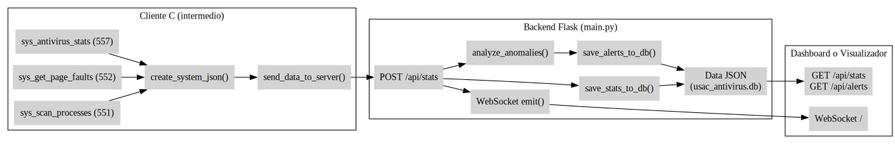

# 🛡️ USAC-AV: Sistema Antivirus con Syscalls Personalizadas

## Teamates

| Full name | carné |
|---|---|
| José Lorenzana | 202206560 |
| Roberto García | 202201724 |
| Javier Avila | 202200392 |
| Diego Gomez | 201908327 |

## Archivo Intermedio y backend

### 📦 Estructura General

``` bash
fases3/
├── intermedio.c       # Cliente en C que usa syscalls
├── intermedio         # Ejecutable compilado
├── main.py            # Backend Flask
└── usac_antivirus.db  # Base de datos SQLite (generada automáticamente)
```

---

### ⚙️ Parte 1: Cliente en C (`intermedio`)

#### 🧱 ¿Qué hace?

- Llama a syscalls personalizadas del kernel Linux para recolectar estadísticas del sistema y procesos activos.
- Construye un objeto JSON con los datos recolectados.
- Envía ese JSON al backend Flask vía HTTP (`POST /api/stats`).
- Opcionalmente escanea archivos y maneja una cuarentena.

#### 🔧 Syscalls utilizadas

| Syscall               | Nº   | Propósito                          |
|----------------------|------|------------------------------------|
| `sys_scan_processes` | 551  | Listar procesos activos            |
| `sys_get_page_faults`| 552  | Obtener fallos de página por PID   |
| `sys_scan_file`      | 553  | Escanear archivo                   |
| `sys_quarantine_file`| 554  | Mover archivo a cuarentena         |
| `sys_get_quarantine_list`| 555 | Ver archivos en cuarentena      |
| `sys_restore_file`   | 556  | Restaurar archivo desde cuarentena |
| `sys_antivirus_stats`| 557  | Obtener estadísticas del sistema   |

#### 🚀 Ejecución

```bash
gcc -o intermedio intermedio.c -lcurl -ljson-c
sudo ./intermedio -m               # Monitoreo 
```

---

### 🌐 Parte 2: Backend Flask (`main.py`)

#### 🧱 Lo que realiza

- Recibe estadísticas desde el cliente C.
- Las guarda en una base de datos SQLite (`usac_antivirus.db`).
- Analiza los datos en busca de anomalías.
- Genera alertas si detecta condiciones críticas (alto uso de memoria, muchos fallos de página, etc).
- Expone endpoints para visualización y consumo de datos.

#### 📁 Base de datos

Contiene 4 tablas:

- `system_stats` → Estadísticas globales.
- `processes` → Procesos más relevantes.
- `alerts` → Alertas generadas.
- `quarantine` → Archivos sospechosos.

#### 🔌 Endpoints disponibles

| Método | URL                   | Función                          |
|--------|------------------------|----------------------------------|
| POST   | `/api/stats`          | Recibe datos del cliente         |
| GET    | `/api/stats`          | Últimos datos registrados        |
| GET    | `/api/stats/history`  | Historial de estadísticas        |
| GET    | `/api/alerts`         | Ver alertas                      |
| GET    | `/api/quarantine`     | Ver archivos en cuarentena       |
| WS     | `/` (WebSocket)       | Enviar datos en tiempo real      |

#### 🚀 Ejecucion

```bash
pip install flask flask-cors flask-socketio eventlet
python3 main.py
```

---

### 📈 Flujo General de Datos

1. `intermedio` ejecuta syscalls y genera un JSON con estadísticas reales del sistema.
2. Envía ese JSON al backend (`POST /api/stats`).
3. El backend lo guarda, analiza, genera alertas y transmite vía WebSocket.
4. Opcionalmente, los datos pueden ser visualizados por un dashboard web o cliente.



---

## 📝 Implementación de Syscalls Personalizadas en el Kernel

A continuación se documenta cómo implementar cada syscall personalizada de este proyecto. Cada syscall corresponde a un archivo fuente en el directorio `kernel/` y su respectiva declaración en el header de `include/linux/usac_syscalls.h`. **Cada archivo es independiente y debe agregarse por separado.**

---

### 1. Declaración de las Syscalls (Header)

Edita el archivo `include/linux/usac_syscalls.h` y agrega las siguientes declaraciones antes del `#endif`:

````c
#ifndef _SYSCALLS_USAC_H
#define _SYSCALLS_USAC_H

#include <linux/syscalls.h>
#include <linux/kernel.h>

#define MAX_PATH 256
#define HASH_LEN 33
#define QUARANTINE_PATH "/var/quarantine/"
#define META_SUFFIX ".meta"
#define MAX_PATH_LEN 512

struct antivirus_stats {
    unsigned long mem_used;
    unsigned long mem_free;
    unsigned long mem_cache;
    unsigned long swap_used;
    unsigned long active_pages;
    unsigned long inactive_pages;
};

struct page_faults_data {
    unsigned long minor_faults;
    unsigned long major_faults;
};

struct process_info {
    pid_t pid;
    pid_t ppid;
    char comm[TASK_COMM_LEN];
    long state;
    unsigned long vsize;
    unsigned long rss;
    int nice;
    unsigned long start_time;
    unsigned long utime;
    unsigned long stime;
};

asmlinkage long sys_xor_encrypt(const char __user *input_file, 
                               const char __user *output_file, 
                               const char __user *key_file, 
                               int num_threads);

asmlinkage long sys_xor_decrypt(const char __user *input_file, 
                               const char __user *output_file, 
                               const char __user *key_file, 
                               int num_threads);

asmlinkage long sys_antivirus_stats(struct antivirus_stats __user *stats);
asmlinkage long sys_quarantine_file(const char __user *path);
asmlinkage long sys_get_page_faults(pid_t pid, struct page_faults_data __user *info);
asmlinkage long sys_scan_file(const char __user *filepath);
asmlinkage long sys_scan_processes(struct process_info __user *buffer, int __user *count);
asmlinkage long sys_restore_file(const char __user *filename);
asmlinkage long sys_get_quarantine_list(char __user *user_buf, size_t buf_size);

#endif
````


### 2. Implementación de cada Syscall (Archivos fuente en kernel/)

Cada syscall debe implementarse en un archivo separado dentro de `kernel/`. Aquí se muestra el contenido de cada archivo y dónde colocarlo en el árbol del kernel real.

#### a) `sys_scan_processes.c`

Coloca este archivo en `kernel/sys_scan_processes.c`:

````c
// filepath: sys_scan_processes.c
#include <linux/kernel.h>
#include <linux/syscalls.h>
#include <linux/sched.h>
#include <linux/sched/signal.h>
#include <linux/uaccess.h>
#include <linux/slab.h>
#include <linux/usac_syscalls.h>

SYSCALL_DEFINE2(scan_processes, struct process_info __user *, buffer, int __user *, count)
{
    struct task_struct *task;
    struct process_info *proc_array;
    int proc_count = 0, i = 0;
    struct mm_struct *mm;
    int user_buffer_size;

    if (!buffer || !count)
        return -EINVAL;

    if (copy_from_user(&user_buffer_size, count, sizeof(int)))
        return -EFAULT;

    rcu_read_lock();
    for_each_process(task) {
        proc_count++;
    }
    rcu_read_unlock();

    if (proc_count == 0) {
        if (copy_to_user(count, &proc_count, sizeof(int)))
            return -EFAULT;
        return 0;
    }

    proc_array = kmalloc_array(proc_count, sizeof(struct process_info), GFP_KERNEL);
    if (!proc_array)
        return -ENOMEM;

    i = 0;
    rcu_read_lock();
    for_each_process(task) {
        proc_array[i].pid = task->pid;
        proc_array[i].ppid = task->real_parent ? task->real_parent->pid : 0;
        strncpy(proc_array[i].comm, task->comm, TASK_COMM_LEN);
        proc_array[i].state = task->state;
        proc_array[i].nice = task_nice(task);
        proc_array[i].start_time = task->start_time;
        proc_array[i].utime = task->utime;
        proc_array[i].stime = task->stime;

        mm = task->mm;
        if (mm) {
            proc_array[i].vsize = mm->total_vm;
            proc_array[i].rss = get_mm_rss(mm);
        } else {
            proc_array[i].vsize = 0;
            proc_array[i].rss = 0;
        }
        i++;
    }
    rcu_read_unlock();

    if (copy_to_user(buffer, proc_array, proc_count * sizeof(struct process_info))) {
        kfree(proc_array);
        return -EFAULT;
    }

    if (copy_to_user(count, &proc_count, sizeof(int))) {
        kfree(proc_array);
        return -EFAULT;
    }

    kfree(proc_array);
    return proc_count;
}
````

#### b) `sys_get_page_faults.c`

Coloca este archivo en `kernel/sys_get_page_faults.c`:

````c
// filepath: sys_get_page_faults.c
#include <linux/kernel.h>
#include <linux/sched.h>
#include <linux/sched/signal.h>
#include <linux/syscalls.h>
#include <linux/uaccess.h>
#include <linux/usac_syscalls.h>

SYSCALL_DEFINE2(get_page_faults, pid_t, pid, struct page_faults_data __user *, info_user) {
    struct task_struct *pid_taskstruct;
    struct page_faults_data page_data_num;

    if (pid <= 0)
        return -EINVAL;

    rcu_read_lock();
    pid_taskstruct = find_task_by_vpid(pid);
    if (!pid_taskstruct) {
        rcu_read_unlock();
        return -ESRCH; 
    }

    task_lock(pid_taskstruct);
    page_data_num.minor_faults = pid_taskstruct->min_flt;
    page_data_num.major_faults = pid_taskstruct->maj_flt;
    task_unlock(pid_taskstruct);
    rcu_read_unlock();

    if (copy_to_user(info_user, &page_data_num, sizeof(page_data_num)))
        return -EFAULT;

    return 0;
}
````

#### c) `sys_scan_file.c`

Coloca este archivo en `kernel/sys_scan_file.c`:

````c
// filepath: sys_scan_file.c
#include <linux/kernel.h>
#include <linux/syscalls.h>
#include <linux/fs.h>
#include <linux/uaccess.h>
#include <linux/slab.h>
#include <linux/usac_syscalls.h>

SYSCALL_DEFINE1(scan_file, const char __user *, filepath)
{
    char *kpath;
    struct file *file;
    char hash[HASH_LEN];
    int ret;

    kpath = kmalloc(MAX_PATH, GFP_KERNEL);
    if (!kpath)
        return -ENOMEM;

    if (copy_from_user(kpath, filepath, MAX_PATH)) {
        ret = -EFAULT;
        goto free_kpath;
    }
    kpath[MAX_PATH - 1] = '\0';

    // Aquí deberías calcular el hash MD5 real del archivo.
    // Por simplicidad, se simula un hash fijo:
    strcpy(hash, "5d41402abc4b2a76b9719d911017c592"); // 'hello' en MD5

    // Aquí podrías comparar el hash con una base de datos de firmas.

    ret = 0; // 0: limpio, 1: sospechoso, 2: malicioso

free_kpath:
    kfree(kpath);
    return ret;
}
````

#### d) `sys_quarantine_file.c`, `sys_restore_file.c`, `sys_get_quarantine_list.c`, `usac_av.c`

Para las syscalls de cuarentena y estadísticas, revisa el archivo [kernel/usac_av.c](kernel/usac_av.c) que implementa:

- `SYSCALL_DEFINE1(quarantine_file, ...)`
- `SYSCALL_DEFINE1(restore_file, ...)`
- `SYSCALL_DEFINE1(antivirus_stats, ...)`
- `SYSCALL_DEFINE2(get_quarantine_list, ...)`

Coloca el archivo completo en `kernel/usac_av.c` y asegúrate de agregarlo al `Makefile` del kernel:

```
obj-y += usac_av.o
```

---

### 3. Registro en la tabla de syscalls

Edita el archivo `arch/x86/entry/syscalls/syscall_64.tbl` y agrega una línea por cada syscall, por ejemplo:

```
551     common   scan_processes      sys_scan_processes
552     common   get_page_faults     sys_get_page_faults
553     common   scan_file           sys_scan_file
554     common   quarantine_file     sys_quarantine_file
555     common   get_quarantine_list sys_get_quarantine_list
556     common   restore_file        sys_restore_file
557     common   antivirus_stats     sys_antivirus_stats
```

---

### 4. Compilación

Asegúrate de agregar cada archivo `.c` al `obj-y` del `kernel/Makefile`:

```
obj-y += sys_scan_processes.o sys_get_page_faults.o sys_scan_file.o usac_av.o
```

Luego recompila el kernel y reinicia.


## Errores
### 1. Errores de argumentos en funciones


Se debe a que estamos pasando un struct user_namespace * como argumento a funciones que esperan tipos distintos (struct mnt_idmap * para vfs_mkdir y struct renamedata * para vfs_rename). Además, la función vfs_rename está recibiendo más argumentos de los que permite.

### 2. Error en parámetros y falta de coordinación con syscalls.h


### 3. Error con BTF


El compilador del kernel no pudo generar el archivo vmlinux debido a que falta la sección .BTF necesaria para el soporte de BPF (eBPF).

